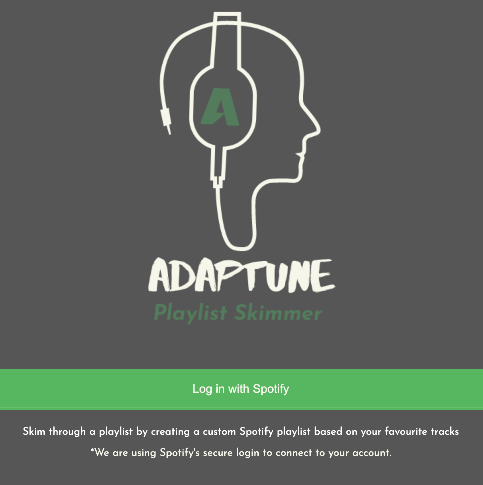

<div id="top"></div>

<br />
<div align="center">
  <a href="https://github.com/jonathanliu22/Spotify-Summarizer-">
    
  </a>

  <h3 align="center">Adaptune</h3>

  <p align="center">
    Skim through a playlist by creating a custom Spotify playlist based on your favourite tracks
    <br />
    <br />
    <a href="https://adaptune.herokuapp.com/">View Deployed Version</a>
  </p>
</div>


<!-- TABLE OF CONTENTS -->
<details>
  <summary>Table of Contents</summary>
  <ol>
    <li>
      <a href="#about-the-project">About The Project</a>
      <ul>
        <li><a href="#built-with">Built With</a></li>
      </ul>
    </li>
    <li>
      <a href="#getting-started">Getting Started</a>
      <ul>
        <li><a href="#prerequisites">Prerequisites</a></li>
        <li><a href="#installation">Installation</a></li>
      </ul>
    </li>
    <li><a href="#acknowledgments">Acknowledgments</a></li>
  </ol>
</details>


<!-- ABOUT THE PROJECT -->
## About The Project

<div align="center">

</div>
<br />


Users want to listen to long playlists such as Spotify's Discover Weekly, but don't have the time to sit through all 1.5 hours of music to decide what they like. Adaptune helps shorten each song in a playlist by finding the loudest section and having users decide whether they like the song based on a 10-25 second sample. This shortens the browsing experience to just 10 minutes (90% decrease!)


<p align="right">(<a href="#top">back to top</a>)</p>


### Built With

* [Flask](https://flask.palletsprojects.com/en/2.1.x/)
* [Bootstrap](https://getbootstrap.com)
* [JQuery](https://jquery.com)
* [HTML]
* [JavaScript]
* [CSS]


<p align="right">(<a href="#top">back to top</a>)</p>


<!-- GETTING STARTED -->
## Getting Started


### Prerequisites

Ensure you have the latest version of Python installed: (https://www.python.org/downloads/)

### Installation

1. Clone the repo
   ```sh
   git clone https://github.com/jonathanliu22/Spotify-Summarizer-.git
   ```
2. Install Python dependencies
   ```sh
   pip install -r requirements.txt
   ```
3. Set the following environment variables with your Spotify API credentials:
   ```sh
   export SPOTIFY_CLIENT_ID="<your client id>"
   export SPOTIFY_CLIENT_SECRET="<your client secret>"
   ```
4. In the [Spotify Developer Dashboard](https://developer.spotify.com/dashboard/applications),
   add `http://127.0.0.1:5000/callback/q` as a redirect URI for your app
5. Run Flask app in terminal
   ```sh
   flask run
   ```

### Running Tests

Run the unit tests with pytest:

```sh
pytest -q
```
<p align="right">(<a href="#top">back to top</a>)</p>


<!-- USAGE EXAMPLES -->
## Usage

<div align="center">

</div>
<br />

1. Log into Spotify account to authorize playback editing and viewing

2. Enter a link to a Spotify Playlist

3. Open up the Spotify App (https://open.spotify.com/)

4. Click play on any/all of the songs to hear a summarized sample

5. Like any of the songs you want to add to a new playlist

6. Click Generate Playlist

<p align="right">(<a href="#top">back to top</a>)</p>


<!-- ACKNOWLEDGMENTS -->
## Acknowledgments

Use this space to list resources you find helpful and would like to give credit to. I've included a few of my favorites to kick things off!

* [WildHacks] (Thank you for organizing this event!)
* [SpotifyAPI] (https://developer.spotify.com/documentation/web-api/)
* [Font Awesome](https://fontawesome.com)

<p align="right">(<a href="#top">back to top</a>)</p>

